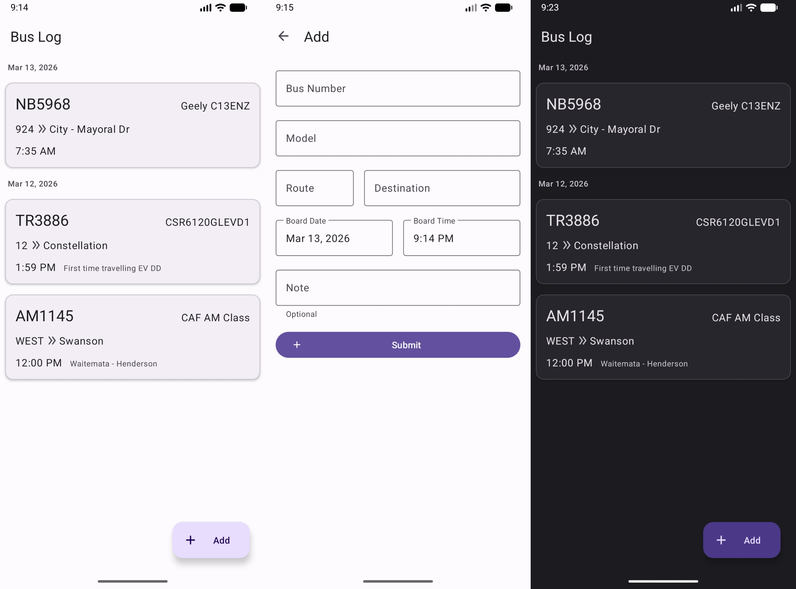

# BusLog App

A small app that lets you keep a record of the transportation you've travelled.

## Functions

- Material 3 UI.
- Dark theme supported.
- `SQLite` based, no internet access required.
- Auto-category based on dates.
- Auto-complete available when adding a record.
- **NEW** Statistics chart - shows how many time have you ride this vehicle/model/line.

### Languages

Currently support:

- English (default)
- Simplified Chinese
- Traditional Chinese

## Screenshots

## Downloads

Available on the [**Release**](https://github.com/Kevincnzuk/BusLog/releases) page.

## License

See [LICENSE.md](LICENSE.md).

## Generative AI

The launcher icon is generated by [Google Gemini 3.1 Pro](https://gemini.google.com/).
